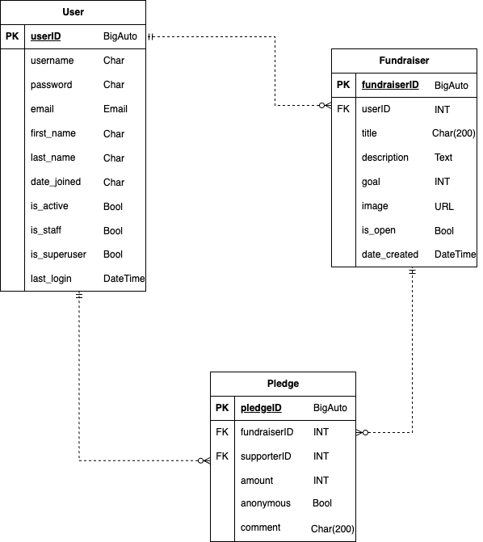

# Crowdfunding Back End

Hyeonah Cho
Link to the website: [SoothingNest](https://soothingnest-ffe15850dd46.herokuapp.com/)

- [Crowdfunding Back End](#crowdfunding-back-end)
  - [Planning:](#planning)
    - [Concept/Name](#conceptname)
    - [Intended Audience/User Stories](#intended-audienceuser-stories)
    - [API Spec](#api-spec)
    - [Insomnia Demonstration](#insomnia-demonstration)
    - [ERD and DB Schema](#erd-and-db-schema)

## Planning:

### Concept/Name

**SoothingNest** is a compassionate crowdfunding platform designed to help pet owners and animal rescuers raise funds for veterinary treatments. Unlike general fundraising sites, SoothingNest focuses on transparency and trust, where donations go directly to registered vets or clinics that provide the treatment, rather than to individuals. If a campaign raises more than the required amount, the extra funds are automatically donated to verified animal shelters, ensuring every dollar supports animal care.

### Intended Audience/User Stories

- **Pet owners** facing unexpected veterinary costs
- **Animal rescuers** seeking treatment support
- **Donors/Supporters** who care about animal welfare and value transparent giving

### API Spec

| URL                      | HTTP Method | Purpose                                               | Request Body                                                                              | Success Response Code | Authentication/Authorisation |
| ------------------------ | ----------- | ----------------------------------------------------- | ----------------------------------------------------------------------------------------- | --------------------- | ---------------------------- |
| `/users/`                | GET         | Retrieve all users                                    | Not required                                                                              | 200 OK                | Public (read-only)           |
| `/users/`                | POST        | Create a new user                                     | `{ "username": Char, "email": email, "password": Char }`                                  | 201 Created           | Public                       |
| `/users/<int:pk>/`       | GET         | Retrieve a single user by ID                          | Not required                                                                              | 200 OK                | Public (read-only)           |
| `/api-token-auth/`       | POST        | Authenticate user and return token, user id and email | `{ "username": Char, "password": Char }`                                                  | 200 OK                | Public                       |
| `/fundraisers/`          | GET         | Retrieve all fundraisers                              | Not required                                                                              | 200 OK                | Public (read-only)           |
| `/fundraisers/`          | POST        | Create a fundraiser                                   | `{ "title": Char(200), "description": Text, "goal": Int, "image": URL, "is_open": Bool }` | 201 Created           | Token required               |
| `/fundraisers/<int:pk>/` | GET         | Retrieve a single fundraises by ID                    | Not required                                                                              | 200 OK                | Public (read-only)           |
| `/fundraisers/<int:pk>/` | PUT         | Update a fundraiser (partial update allowed)          | Partial or all fields of a fundraiser                                                     | 200 OK                | Token required + owner only  |
| `/pledges/`              | GET         | Retrieve all pledges                                  | Not required                                                                              | 200 OK                | Public (read-only)           |
| `/pledges/`              | POST        | Create a pledge                                       | `{ "amount": Int, "comment": Char(200), "anonymous": Bool, "fundraiser": Int }`           | 201 Created           | Token required               |

### Insomnia Demonstration

### ERD and DB Schema

